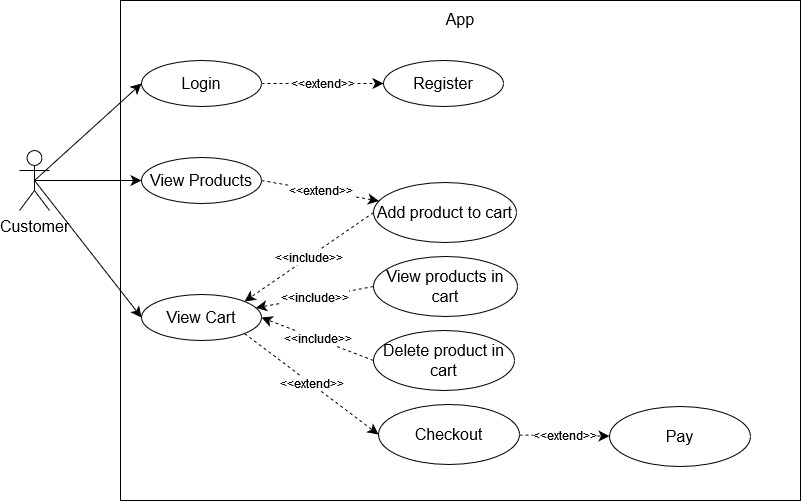
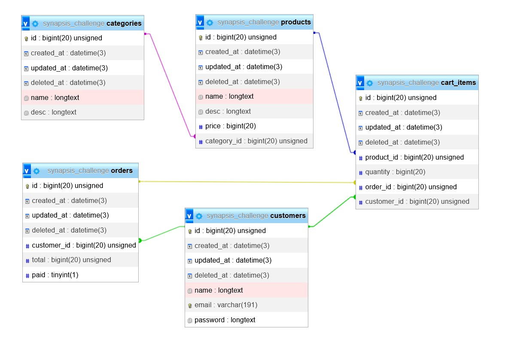

# SynapsisChallenge

This repository contains REST API build using Go [Fiber framework](https://gofiber.io/). This API built for e-commerce which user(customer role yet) has this following access:

- Customer can view product list by product category
- Customer can add product to shopping cart
- Customers can see a list of products that have been added to the shopping cart
- Customer can delete product list in shopping cart
- Customers can checkout and make payment transactions
- Login and register customers

## Diagram

### Use Case Diagram

I have create use case diagram to make those access (by customer) easier to understands.

### Entity Relations Diagram

Table relation diagram for those functionality.

## API Docs

[Postman API documentation](https://documenter.getpostman.com/view/17703536/2s93CEvbNu)
